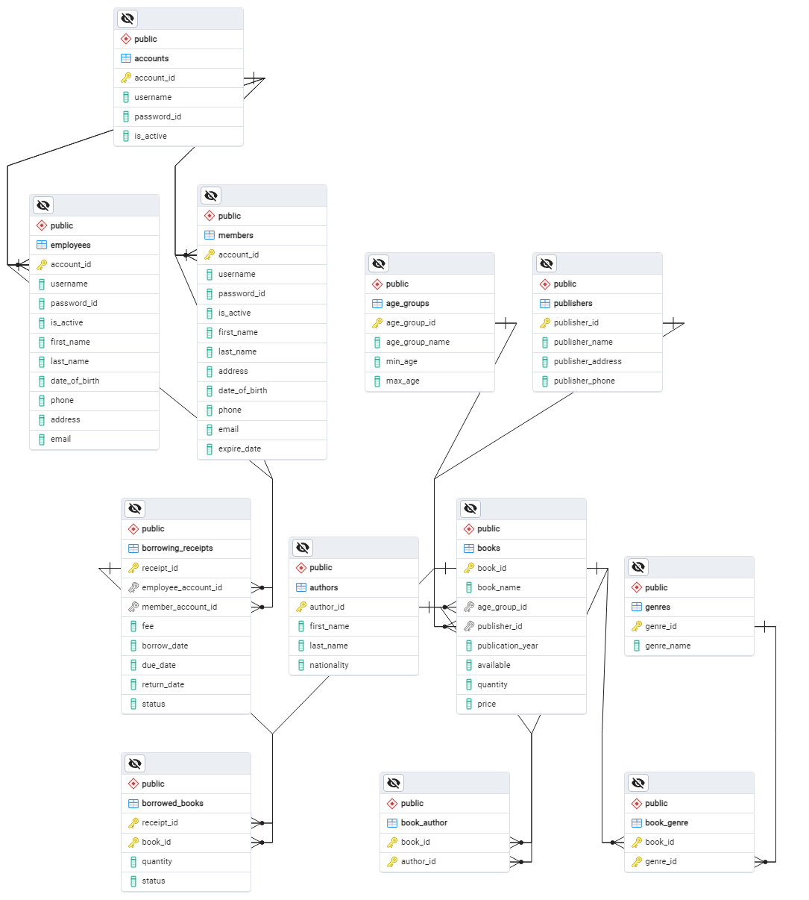

# Library Management Database

## Table of Contents

1. [Overview](#overview)
2. [Features](#features)
3. [Database Schema](#database-schema)
4. [Getting Started](#getting-started)
   - [Prerequisites](#prerequisites)
   - [Installation](#installation)
5. [Usage](#usage)
6. [Scripts](#scripts)
7. [Contributing](#contributing)

## Overview

This repository contains the database schema and scripts for managing a library's database. The database is designed to handle various aspects of library management, including book inventory, member information, and borrowing transactions.

## Features

- **Books Management**: Store details about books such as title, author, genre, publication date, and availability status.
- **Member Management**: Keep track of library members, including their personal details and membership status.
- **Borrowing System**: Record and manage borrowing transactions, including due dates and return statuses.
- **Fine Calculation**: Automatically calculate fines for overdue books.
- **Reports**: Generate reports on book inventory, borrowing history, and member activity.

## Database Schema

The database schema consists of the following tables:



## Getting Started

### Prerequisites

- PostgreSQL.
- SQL client tool (e.g., PgAdmin4).

### Installation

1. Clone the repository:

   ```sh
   git clone https://github.com/HaiYen3012/Library-Manager.git
   cd library-management-database
   ```
2. Create the database and tables by executing the SQL script `DbLibraryManager.sql`
* Open `PgAdmin4`
* Create new Database
* Restore `DbLibraryManager.sql`

## Usage
* `Adding Books`: Insert new records into the `Books` table.
* `Registering Members`: Insert new records into the `Members` table.
* `Borrowing Books`: Insert new records into the `Borrowing_Receipts` table, and update the Books table status to 'Borrowed'.
* `Returning Books`: Update the `Borrowing_Receipts` table with the return date and update available record in the `Books` table.
* `Calculating Fines`: Check the `Fees` table for any overdue fines and update the payment status.

## Scripts
* `DbLibraryManager.sql`: Creates all the necessary tables, triggers, functions, Procedures, Views and Roles for the library management system.

*`ScriptsDB_QuanLyThuVien.SQL`: Contains SQL Queries for the library management system.

## Contributing

Contributions are welcome! Please open an issue or submit a pull request for any improvements or bug fixes.
